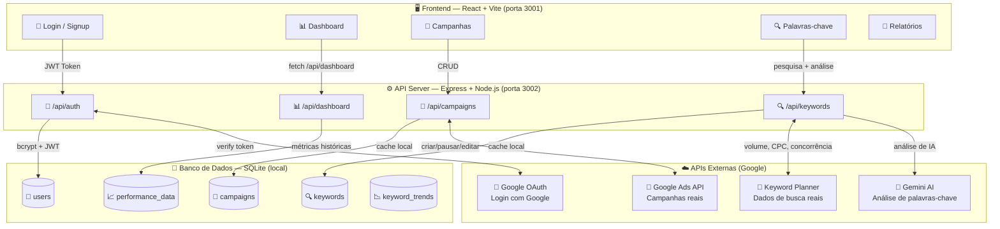
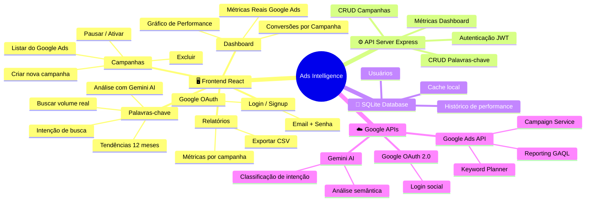
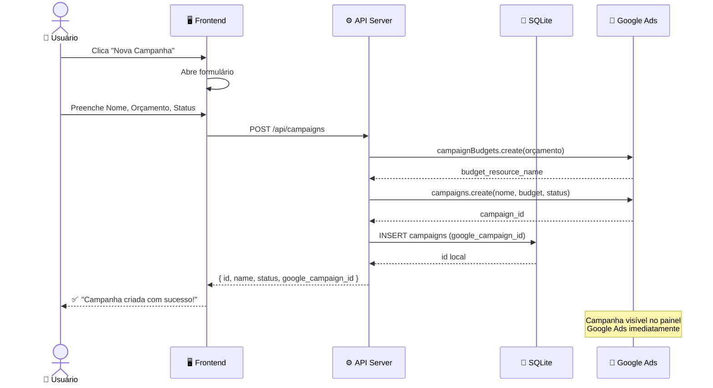
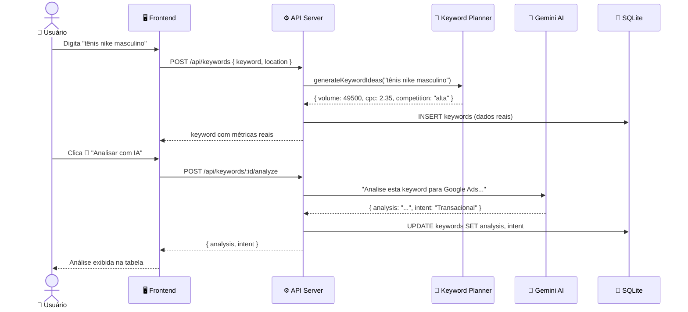
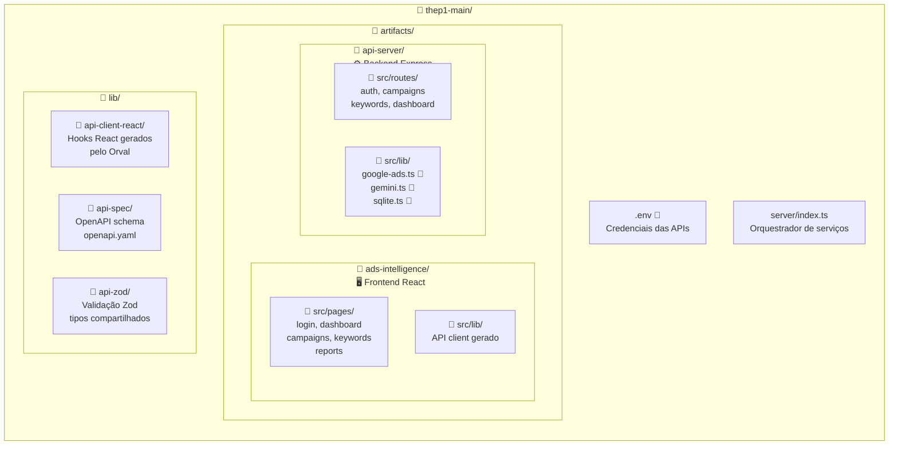
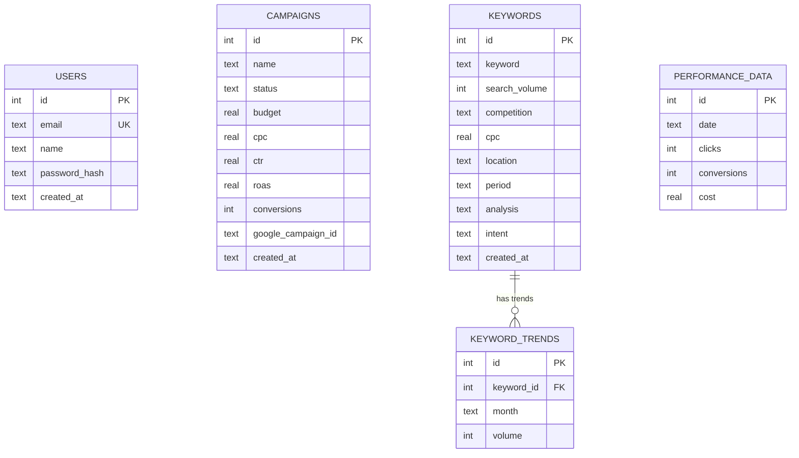

# 🚀 Ads Intelligence — README

> Plataforma de inteligência de campanhas Google Ads com IA integrada.

---

## 🗺️ Mapa da Arquitetura



---

## 🧠 Brainstorm — Como Tudo se Conecta



---

## 🔄 Fluxo de uma Campanha (do clique ao Google Ads)



---

## 🔄 Fluxo de Pesquisa de Palavras-chave



---

## 🏗️ Estrutura do Projeto



---

## 🔑 GUIA PASSO A PASSO — Como Obter Cada API

---

### 🤖 PASSO 1 — Gemini AI (MAIS FÁCIL, 2 minutos)

**O que dá:** Análise inteligente de palavras-chave com IA real.

1. Acesse: **https://aistudio.google.com/apikey**
2. Clique em **"Create API key"**
3. Selecione um projeto Google (ou crie um novo)
4. Copie a chave gerada
5. Cole no `.env`:
   ```
   GEMINI_API_KEY=AIza...sua_chave_aqui
   ```

✅ **Pronto! Custo: R$ 0/mês** (60 requests/minuto grátis)

---

### 🔐 PASSO 2 — Google OAuth (Login com Google, 10 minutos)

**O que dá:** Botão "Entrar com Google" funcional.

1. Acesse: **https://console.cloud.google.com/**
2. Clique em **"Selecionar projeto"** → **"Novo projeto"**
   - Nome: `Ads Intelligence`
3. No menu lateral: **APIs e serviços** → **Tela de permissão OAuth**
   - Tipo: **Externo** → Salvar
   - Preencha: nome do app, e-mail de suporte
4. **APIs e serviços** → **Credenciais** → **Criar credenciais** → **ID do cliente OAuth 2.0**
   - Tipo: **Aplicativo da Web**
   - Origens autorizadas: `http://localhost:3001`
   - URIs de redirecionamento: `http://localhost:3001`
5. Copie o **Client ID** e cole no `.env`:
   ```
   GOOGLE_CLIENT_ID=123456789-abc.apps.googleusercontent.com
   ```

✅ **Pronto! Custo: R$ 0/mês**

---

### 📢 PASSO 3 — Google Ads API (20–30 minutos)

**O que dá:** Dados reais de busca, criação de campanhas no Google Ads.

#### 3a. Criar Conta de Manager Google Ads (MCC)
1. Acesse: **https://ads.google.com/intl/pt-BR/home/tools/manager-accounts/**
2. Clique em **"Criar uma conta de gerente"**
3. Siga o processo (não precisa colocar cartão de crédito para conta Manager)

#### 3b. Obter Developer Token
1. Dentro do Google Ads Manager → **Ferramentas e configurações** (ícone de chave inglesa)
2. → **Configuração** → **Central de API**
3. Clique em **"Solicitar acesso"** → escolha **"Token de teste"** (aprovação imediata)
4. Copie o token e cole no `.env`:
   ```
   GOOGLE_ADS_DEVELOPER_TOKEN=seu_developer_token_aqui
   ```

> ⚠️ O token de teste funciona apenas com contas de teste. Para produção, você precisa solicitar acesso básico (leva 1–3 dias de aprovação pelo Google).

#### 3c. Criar Credenciais OAuth para o Google Ads
1. No **Google Cloud Console** (projeto criado no Passo 2)
2. **APIs e serviços** → **Biblioteca** → buscar **"Google Ads API"** → Ativar
3. **Credenciais** → **Criar credenciais** → **ID do cliente OAuth 2.0**
   - Tipo: **Aplicativo para computador** (Desktop)
4. Copie **Client ID** e **Client Secret** para o `.env`:
   ```
   GOOGLE_ADS_CLIENT_ID=123456789-abc.apps.googleusercontent.com
   GOOGLE_ADS_CLIENT_SECRET=GOCSPX-seu_secret_aqui
   ```

#### 3d. Gerar Refresh Token
Execute o script helper (que vou criar):
```bash
npx tsx scripts/get-refresh-token.ts
```
- O script abrirá o browser para você autorizar
- Cole o token gerado no `.env`:
  ```
  GOOGLE_ADS_REFRESH_TOKEN=1//04...seu_refresh_token
  ```

#### 3e. Encontrar seu Customer ID
1. No Google Ads → olhe no canto superior direito
2. Você verá algo como **123-456-7890** — este é seu Customer ID
3. Cole no `.env`:
   ```
   GOOGLE_ADS_CUSTOMER_ID=1234567890
   GOOGLE_ADS_LOGIN_CUSTOMER_ID=1234567890
   ```

✅ **Pronto! Custo: R$ 0** (API gratuita, você paga apenas pelos anúncios que rodar)

---

## 🎯 Resumo de Custos

| API | Gratuito | Limite grátis |
|-----|----------|---------------|
| Gemini AI (análise) | ✅ Sim | 60 req/min, 1500/dia |
| Google OAuth (login) | ✅ Sim | Ilimitado |
| Google Ads API | ✅ Sim | Rate limits generosos |
| Keyword Planner | ✅ Sim* | *Dados exatos exigem spend |
| SQLite (banco) | ✅ Sim | Ilimitado |
| **TOTAL** | **R$ 0/mês** | — |

---

## ⚡ Próximos Passos de Desenvolvimento

```mermaid
graph LR
    A["✅ Fase 1\nGemini AI\n(Análise de keywords)"]
    B["✅ Fase 2\nCSV Export\n(Relatórios)"]
    C["✅ Fase 3\nGoogle OAuth\nendpoint"]
    D["🔄 Fase 4\nGoogle Ads API\nWrapper criado"]
    E["⏳ Fase 5\nKeywords Route\n+ Keyword Planner"]
    F["⏳ Fase 6\nCampaigns Route\n+ Google Ads sync"]
    G["⏳ Fase 7\nDashboard\n+ métricas reais"]
    H["⏳ Fase 8\nLogin Google\nUI + Protected Routes"]
    I["⏳ Fase 9\nScript OAuth\nRefresh Token helper"]
    J["🚀 PRODUÇÃO"]

    A --> B --> C --> D --> E --> F --> G --> H --> I --> J
```



### 🔄 O Que Falta Fazer Agora:

1. **Atualizar `keywords.ts`** — usar Keyword Planner para dados reais
2. **Atualizar `campaigns.ts`** — sincronizar com Google Ads
3. **Atualizar `dashboard.ts`** — métricas reais do Google Ads
4. **Criar `scripts/get-refresh-token.ts`** — helper para autenticação
5. **Atualizar `login.tsx`** — botão Google funcional
6. **Atualizar `App.tsx`** — rotas protegidas reais

---

## 🏃 Como Rodar Localmente

```bash
# 1. Instalar dependências
npx pnpm install

# 2. Configurar as APIs (preencher o .env)
# Siga o guia acima

# 3. Iniciar todos os serviços
npx tsx server/index

# Serviços rodando:
# - Frontend: http://localhost:3001
# - API Server: http://localhost:3002
# - Sandbox: http://localhost:3000
```

---

## 📊 Modelo de Dados


